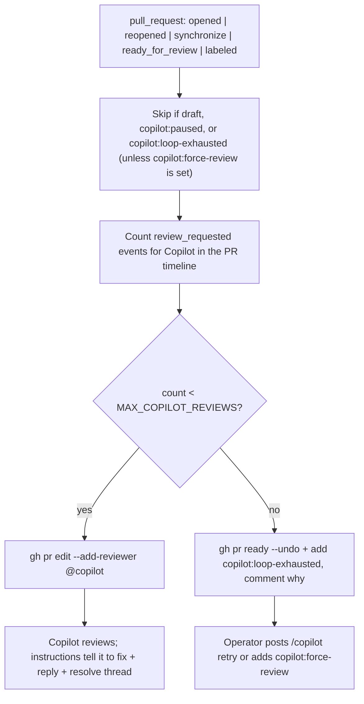

# Copilot PR Babysit

A small workflow that auto-requests a Copilot review on every push
to a non-draft PR, capped at a lifetime maximum per PR. The cap is
counted from GitHub's timeline (no hidden state), and the workflow
parks PRs that exceed the cap in draft mode so further pushes do
not trigger reviews.

The full design history lives at
[`.cursor/plans/copilot-pr-babysit_d407c87b.plan.md`](../../.cursor/plans/copilot-pr-babysit_d407c87b.plan.md).

## Architecture



The single piece of automation is
[`/.github/workflows/copilot-request-review.yml`](../workflows/copilot-request-review.yml).
There is no controller comment, no shared state file, no GitHub
Models call. The lifetime cap is the loop guard; per-comment
deduping is unnecessary because Copilot only reviews when explicitly
requested (the `copilot_code_review` ruleset's auto-review-on-push
is intentionally disabled — see Prerequisites below).

## Prerequisites

The repository's `copilot_code_review` ruleset rule must have
`review_on_push: false` (or be removed). Otherwise both this
workflow and the ruleset will compete to assign Copilot, doubling
review requests and blowing through the cap.

```bash
gh api repos/<owner>/<repo>/rulesets --jq '.[] | {id, name}'
gh api repos/<owner>/<repo>/rulesets/<ruleset-id>
```

## Labels

Only three labels exist; the workflow manages two of them and the
operator owns the third.

| Label | Owned by | Meaning |
|-------|----------|---------|
| `copilot:paused` | operator | Skip the workflow on this PR. |
| `copilot:loop-exhausted` | workflow | Cap reached; PR is parked in draft. The workflow auto-applies/removes this. |
| `copilot:force-review` | operator | Single-shot override: ignore the cap and request a review now. The workflow removes the label after firing. |

`labels.json` is the manifest used to bootstrap them; run the
workflow's bootstrap step (or `gh label create` manually) once per
repo.

## Operator commands

The workflow takes no slash commands directly. The semantics below
are how operators interact with it via labels:

| Intent | Action |
|--------|--------|
| Pause the workflow on a PR | Add `copilot:paused`. |
| Resume the workflow | Remove `copilot:paused`. |
| Force a review past the cap | Add `copilot:force-review`. The workflow requests the review and auto-removes the label. |
| Reset cap and try again | Remove `copilot:loop-exhausted` and mark the PR ready (or add `copilot:force-review`). The lifetime counter still reflects history; the cap will trip again. |

## Loop budget

| Setting | Default | Source |
|---------|---------|--------|
| `MAX_COPILOT_REVIEWS` | `5` | `env` block in [the workflow](../workflows/copilot-request-review.yml). |

The cap counts every prior `review_requested` timeline event whose
`requested_reviewer.login` is `Copilot`. There is no per-HEAD
counter; once a PR has had five Copilot reviews it is parked, and
the operator chooses whether to keep going.

## Files in this directory

- [`labels.json`](labels.json) — manifest of the three labels the
  workflow manages.
- [`SPIKE.md`](SPIKE.md) — verification runbook.
- [`CI-GATES.md`](CI-GATES.md) — why no slow-CI label gating was
  added.
