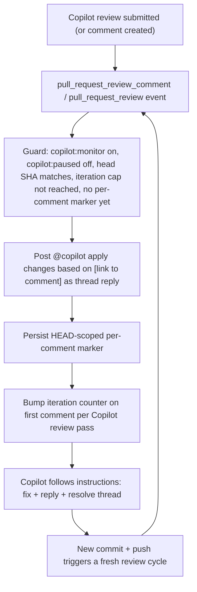

# Copilot PR Babysit

Workflow-driven auto-responder that drives a PR through Copilot
review and fix without any GitHub Models inference in the critical
path. The babysitter listens for Copilot review comments, posts a
single `@copilot apply changes based on [link]` reply per comment,
and relies on Copilot's own custom-instruction-driven behavior to
fix the issue and resolve the thread.

The full design lives at
[`.cursor/plans/copilot-pr-babysit_d407c87b.plan.md`](../../.cursor/plans/copilot-pr-babysit_d407c87b.plan.md).

## Architecture

GitHub Models is still available behind a feature flag for triage
when a PR has noisy Copilot comments and the operator wants to
filter `Style/Pedantic` findings before tagging. The default is
**off** because the auto-tag flow does not need it.

## Layers

1. **Copilot custom instructions**
   [`/.github/copilot-instructions.md`](../copilot-instructions.md),
   [`/.github/instructions/pr-babysit.instructions.md`](../instructions/pr-babysit.instructions.md)
   (cloud agent),
   [`/.github/instructions/code-review.instructions.md`](../instructions/code-review.instructions.md)
   (code review). The cloud-agent instructions tell Copilot to
   resolve the review thread after applying a fix; that is what
   makes the auto-tag loop terminate cleanly.
2. **Auto-responder workflow**
   [`/.github/workflows/copilot-pr-respond.yml`](../workflows/copilot-pr-respond.yml)
   tags Copilot once per unresolved review comment on the current
   HEAD.
3. **Command workflow**
   [`/.github/workflows/copilot-pr-command.yml`](../workflows/copilot-pr-command.yml)
   parses `/copilot ...` slash commands and toggles labels.
4. **Cron monitor**
   [`/.github/workflows/copilot-pr-monitor.yml`](../workflows/copilot-pr-monitor.yml)
   recovers from suppressed Copilot review events.
5. **Durable state** lives in PR labels, a single hidden controller
   comment, and HEAD-scoped per-comment markers. See
   [STATE.md](STATE.md).

## Command protocol

Operators drive the controller by labels and slash commands.

### Labels (operator-visible state)

| Label | Meaning |
|-------|---------|
| `copilot:monitor` | Auto-responder is enabled for this PR. |
| `copilot:paused` | Auto-responder exits without action. |
| `copilot:review-pending` | Waiting for Copilot review on current HEAD. |
| `copilot:feedback` | Current HEAD has actionable review comments. |
| `copilot:clean` | Latest Copilot review on current HEAD has no comments. |
| `copilot:needs-human` | Guards detected an unsafe/ambiguous state. |
| `copilot:loop-exhausted` | Iteration budget reached for current HEAD. |

### Slash commands (PR comments)

| Command | Effect |
|---------|--------|
| `/copilot babysit` | Add `copilot:monitor`, allow auto-responder to run. |
| `/copilot pause` | Add `copilot:paused`, auto-responder exits next event. |
| `/copilot resume` | Remove `copilot:paused`. |
| `/copilot stop` | Remove `copilot:monitor` and add `copilot:paused`. |
| `/copilot status` | Post a status comment with current counters. |
| `/copilot retry` | Reset HEAD-scoped iteration counter for the current HEAD. Does not change `headSha`. |

The literal `@copilot` mention is reserved for actually invoking
Copilot. The auto-responder posts `@copilot apply changes based on
[this feedback](URL)` as a thread reply; it never posts `@copilot
review` to ask for a review.

## Triggers

| Trigger | Purpose |
|---------|---------|
| `pull_request_review_comment.created` | Primary: Copilot just left a review comment. |
| `pull_request_review.submitted` | Primary: bump iteration count when Copilot completes a review. |
| `pull_request: opened, reopened, synchronize, ready_for_review, converted_to_draft, labeled, unlabeled` | State sync on push and operator label edits. |
| `issue_comment.created` | Slash commands. |
| `schedule: cron */30` | Recovery for suppressed Copilot events. |
| `workflow_dispatch` | Manual invocation. |

`pull_request_review_comment` and `pull_request_review` are the fast
path; the cron monitor in `copilot-pr-monitor.yml` is the safety net
because Copilot bot events can be silently suppressed by GitHub.

## Loop budgets and cooldowns

| Budget | Default | Notes |
|--------|---------|-------|
| Max Copilot review/fix cycles per HEAD | 3 | Resets on push (HEAD change); `/copilot retry` resets without changing HEAD. |
| Iteration severity threshold | 1: 2+, 2: 3+, 3+: 4+ | Only used when triage is enabled. |
| Per-comment cooldown | One reply per `<HEAD,reviewCommentId>` pair | Enforced by HEAD-scoped marker. |
| Active local marker TTL | 30m | Workflow yields while the marker is fresh. |

## Optional triage

When `BABYSIT_TRIAGE` is set to `on` (workflow env or repo
variable), the auto-responder calls GitHub Models with the triage
prompt before tagging. Comments classified as
`recommendation: "Address"` with `severity >= iterationThreshold`
get tagged; the rest get a brief reply explaining why they were
deferred and the thread is left unresolved for human triage.

The default is **off** because the simpler auto-tag flow already
works and avoids a model call on every event.

## Files in this directory

- [`labels.json`](labels.json) — manifest the bootstrap workflow
  uses to ensure labels exist with the right colors and
  descriptions.
- [`STATE.md`](STATE.md) — schema and lifecycle of the hidden state
  comment and HEAD-scoped suppression markers.
- [`prompt-triage.md`](prompt-triage.md) — system prompt for the
  optional Copilot-comment triage step.
- [`schema-state.json`](schema-state.json) and
  [`schema-triage.json`](schema-triage.json) — JSON Schema
  validators used by the shell guard.
- [`scripts/`](scripts) — bash helpers used by the workflows.
- [`RALPH-EVAL.md`](RALPH-EVAL.md) — explanation of why we did not
  ship a Ralph Wiggum-style local shell loop in this repository.
